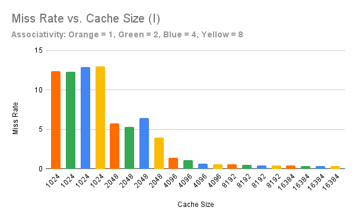
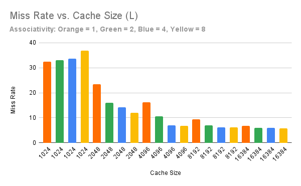
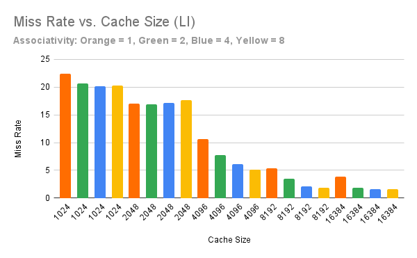

Name: Darren Ang\
Email: dang004@ucr.edu\
Assignment name: Lab06-Caches\
Lab section: 21\
TA: Nurlan Nazaraliyev

## Graphs
\
\

## Analysis
For my report, I chose to run the hello.cpp file with a full cache, a data cache, and an instruction cache.

For each cache type, I tested cache sizes from 1024 - 16384, associativity from 1-8, and recorded the miss rates.

For this simulation, we assume that cache size increases linearly with cost, and doubling associativity increases cost by 10%.

In addition, a "good" threshold will be anything under 5% for the full cache, 10% for the data cache, and 5% for the instruction cache.

**Cost: 1024 = $1**

For the full cache, this threshold is met when the cache size is 8192 and the associativity is 2, the cost would come out to 8 for the cache size, and an extra 10% for the 2 way associativity. Thus the cost would come out to $8.8

The data cache threshold is met when size is 4096, with an associativity of 4. The cost is $4.8.
The instruction cache threshold is met when size is 2048 with an associativity of 8. The cost is $2.6.
The combined cost is $7.4.

Thus we can conclude that having seperate caches for instruction and data is more cost efficient than having a full cache.